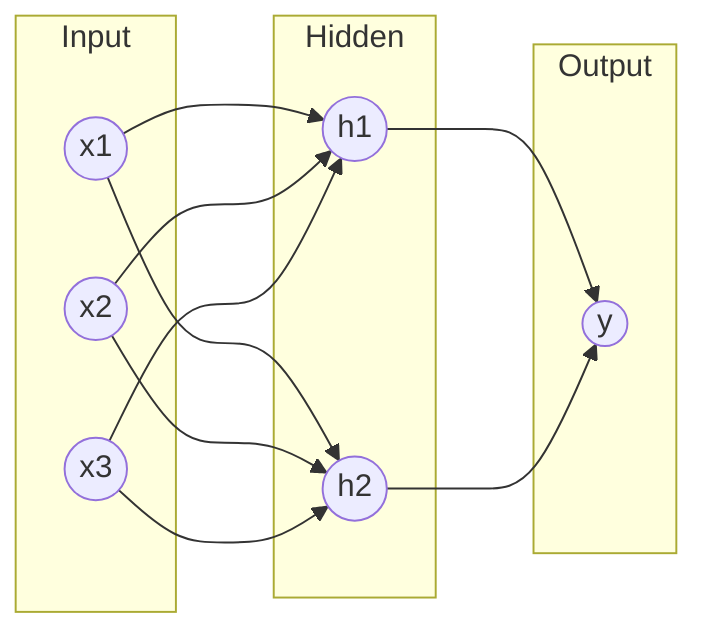
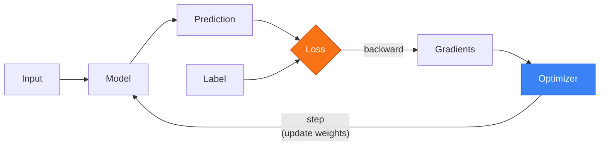

# Neural Network Basics

What they are and how they learn

---
layout: default
---

# What is a Neural Network?

### The Concept

A neural network is a **function approximator** composed of:

- **Layers** of interconnected nodes (neurons)
- **Weights** that are learned from data
- **Activation functions** that add non-linearity

### Why "Neural"?

Loosely inspired by biological neurons, but the math is what matters:

$$y = f(Wx + b)$$

Where $W$ = weights, $b$ = bias, $f$ = activation

A simple feedforward network with one hidden layer

---
layout: default
---

# How Neural Networks Learn

**1. Forward**

Pass input through model to get prediction

**2. Loss**

Compare prediction to true label

**3. Backward**

Compute gradients via autograd

**4. Update**

Optimizer adjusts weights

This cycle repeats until the model learns the patterns in the data.

