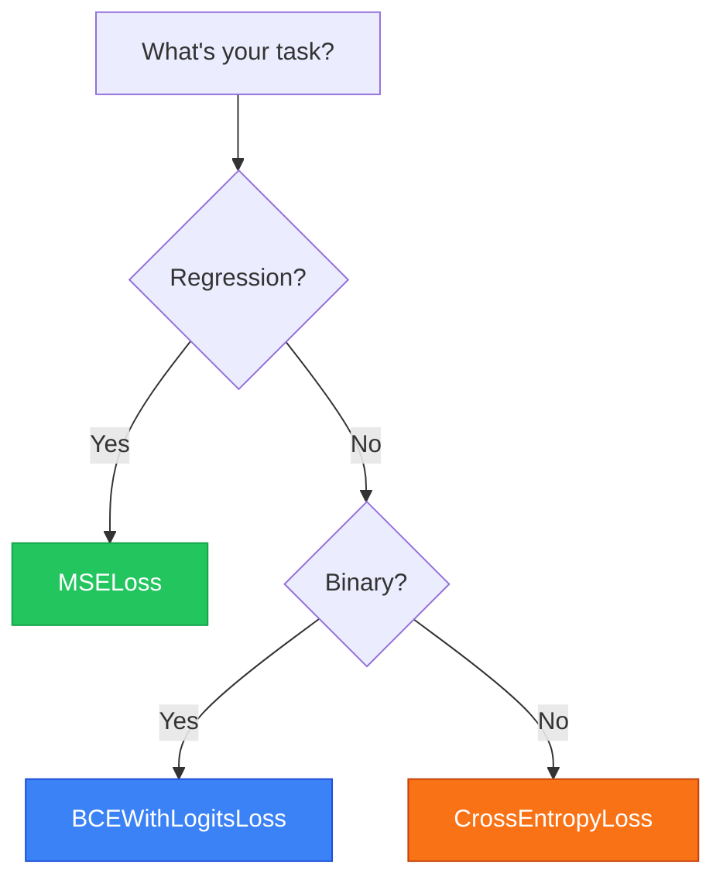

# Loss Functions

Measuring how wrong your predictions are

---
layout: default
---

# What is a Loss Function?

<div class="grid grid-cols-2 gap-8 mt-4">

<div>

### The Concept

A loss function (or criterion) **quantifies the error** between predictions and true values.

<div class="mt-4">

### Properties of Good Loss Functions

- **Differentiable** - so we can compute gradients
- **Lower is better** - 0 = perfect predictions
- **Task-appropriate** - regression vs classification

</div>

<div class="mt-4">

$$\text{Loss} = f(\text{prediction}, \text{target})$$

The goal of training: **minimize the loss**.

</div>

</div>

<div>

```python
import torch.nn as nn

# Define a loss function
criterion = nn.MSELoss()

# Compute loss
predictions = model(inputs)
loss = criterion(predictions, targets)

print(f"Loss: {loss.item():.4f}")

# Backpropagate
loss.backward()
```

<div class="mt-4 p-3 bg-blue-50 dark:bg-blue-900/30 rounded text-sm">

**Key insight**: The loss value tells the optimizer *how much* to adjust weights, and gradients tell it *which direction*.

</div>

</div>

</div>

---
layout: default
---

# Common Loss Functions

<div class="text-sm">

| Loss Function | Use Case | Output Range |
|--------------|----------|--------------|
| `nn.MSELoss()` | Regression | Any real number |
| `nn.L1Loss()` | Regression (robust to outliers) | Any real number |
| `nn.CrossEntropyLoss()` | Multi-class classification | Raw logits (no softmax) |
| `nn.BCEWithLogitsLoss()` | Binary classification | Raw logits (no sigmoid) |

</div>

<div class="grid grid-cols-2 gap-6 mt-2">

<div>

### Regression: MSE Loss

```python
criterion = nn.MSELoss()
pred = torch.tensor([2.5, 0.0, 2.1])
target = torch.tensor([3.0, -0.5, 2.0])
loss = criterion(pred, target)  # = 0.135
```

<div class="text-sm mt-2">

Averages squared differences: $\text{MSE} = \frac{1}{n}\sum(y_i - \hat{y}_i)^2$

</div>

</div>

<div>

### Classification: Cross-Entropy

```python
criterion = nn.CrossEntropyLoss()
# Raw logits (NOT probabilities!)
logits = torch.tensor([[2.0, 1.0, 0.1]])
target = torch.tensor([0])  # Class index
loss = criterion(logits, target)  # = 0.417
```

<div class="text-sm mt-2">

Penalizes wrong class predictions: $\text{CE} = -\sum y_c \log(\hat{y}_c)$

</div>

</div>

</div>

---
layout: default
---

# Choosing the Right Loss Function

<div class="grid grid-cols-2 gap-8 mt-2">

<div>

### Decision Guide



</div>

<div>

### Common Mistakes

<div class="space-y-2 text-sm">

<div class="p-2 bg-red-50 dark:bg-red-900/30 rounded">

**Don't** apply softmax before `CrossEntropyLoss` - it's built in!

</div>

<div class="p-2 bg-red-50 dark:bg-red-900/30 rounded">

**Don't** apply sigmoid before `BCEWithLogitsLoss` - it's built in!

</div>

<div class="p-2 bg-green-50 dark:bg-green-900/30 rounded">

**Do** use `BCEWithLogitsLoss` over `BCELoss` - more stable.

</div>

<div class="p-2 bg-green-50 dark:bg-green-900/30 rounded">

**Do** check your target shape matches what the loss expects.

</div>

</div>

</div>

</div>
